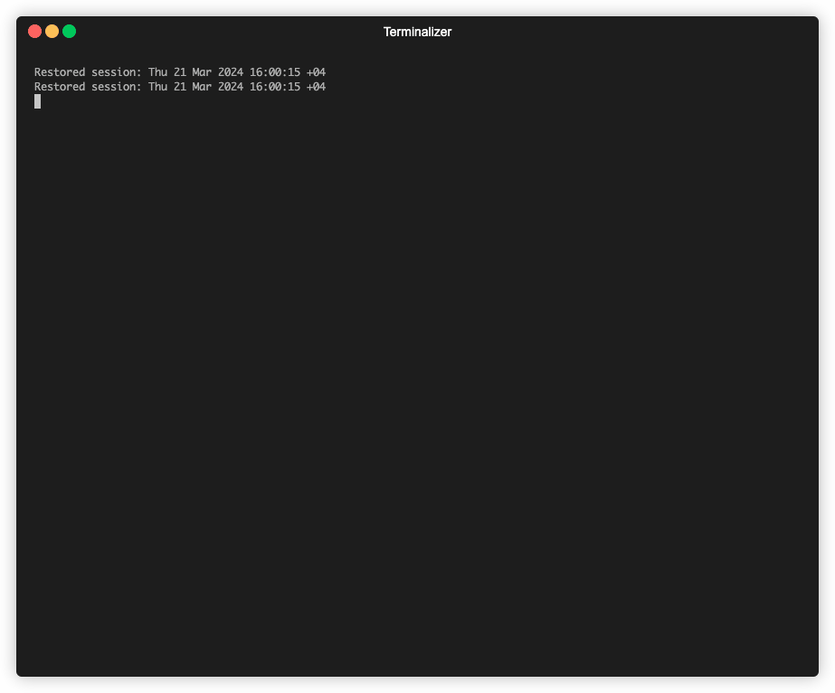
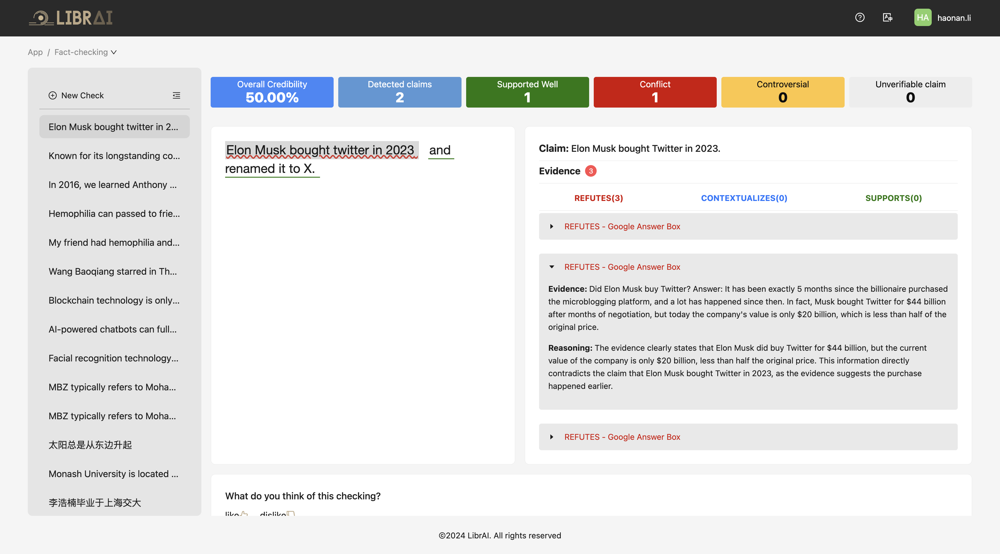

<div align="center">
  <br />
    <a href="https://www.librai.tech">
      
    </a>
  <br />
</div>

# Loki: An Open-source Tool for Fact Verification

## Overview
Loki is our open-source solution designed to automate the process of verifying factuality. It provides a comprehensive pipeline for dissecting long texts into individual claims, assessing their worthiness for verification, generating queries for evidence search, crawling for evidence, and ultimately verifying the claims. This tool is especially useful for journalists, researchers, and anyone interested in the factuality of information. To stay updated, please subscribe to our newsletter at [our website](https://www.librai.tech/) or join us on [Discord](https://discord.gg/ssxtFVbDdT)!


## Quick Start

### Clone the repository and navigate to the project directory
```bash
git clone https://github.com/Libr-AI/OpenFactVerification.git
cd OpenFactVerification
```

### Installation with poetry (option 1)
1. Install Poetry by following it [installation guideline](https://python-poetry.org/docs/).
2. Install all dependencies by running:
```bash
poetry install
```

### Installation with pip (option 2)
1. Create a Python environment at version 3.9 or newer and activate it.

2. Navigate to the project directory and install the required packages:
```bash
pip install -r requirements.txt
```

### Configure API keys

You can choose to export essential api key to the environment

- Example: Export essential api key to the environment
```bash
export SERPER_API_KEY=... # this is required in evidence retrieval if serper being used
export OPENAI_API_KEY=... # this is required in all tasks
```

Alternatively, you configure API keys via a YAML file, see [user guide](docs/user_guide.md) for more details.

A sample test case:
<div align="center">
	
</div>

## Usage

The main interface of Loki fact-checker located in `factcheck/__init__.py`, which contains the `check_response` method. This method integrates the complete fact verification pipeline, where each functionality is encapsulated in its class as described in the Features section.

#### Used as a Library

```python
from factcheck import FactCheck

factcheck_instance = FactCheck()

# Example text
text = "Your text here"

# Run the fact-check pipeline
results = factcheck_instance.check_response(text)
print(results)
```

#### Used as a Web App
```bash
python webapp.py --api_config demo_data/api_config.yaml
```

#### Multimodal Usage

```bash
# String
python -m factcheck --modal string --input "MBZUAI is the first AI university in the world"
# Text
python -m factcheck --modal text --input demo_data/text.txt
# Speech
python -m factcheck --modal speech --input demo_data/speech.mp3
# Image
python -m factcheck --modal image --input demo_data/image.webp
# Video
python -m factcheck --modal video --input demo_data/video.m4v
```


#### Customize Your Experience
For advanced usage, please see our [user guide](docs/user_guide.md).

## [Try Our Online Service](https://aip.librai.tech/login)

<!-- 💪 **Join Our Journey to Innovation with the Supporter Edition** -->

As we continue to evolve and enhance our fact-checking solution, we're excited to invite you to become an integral part of our journey. By registering for our Supporter Edition, you're not just unlocking a suite of advanced features and benefits; you're also fueling the future of trustworthy information.


Below is a screenshot of our online service.
[Click here  to try it now!](https://aip.librai.tech/login)

<div align="center">
	
</div>

<!--
Your support enables us to:

🚀 Innovate continuously: Develop new, cutting-edge features that keep you ahead in the fight against misinformation.

💡 Improve and refine: Enhance the user experience, making our app not just powerful, but also a joy to use.

🌱 Grow our community: Invest in the resources and tools our community needs to thrive and expand.

🎁 And as a token of our gratitude, registering now grants you **complimentary token credits**—a little thank you from us to you, for believing in our mission and supporting our growth!

<div align="center">

| Feature                                | Open-Source Edition | Supporter Edition |
|----------------------------------------|:-------------------:|:------------------:|
| Trustworthy Verification Results       | ✅                   | ✅                  |
| Diverse Evidence from the Open Web     | ✅                   | ✅                  |
| Automated Correction of Misinformation | ✅                   | ✅                  |
| Privacy and Data Security              | ✅                   | ✅                  |
| Multimodal Input                       | ✅                   | ✅                  |
| One-Stop Custom Solution               | ❌                   | ✅                  |
| Customizable Verification Data Sources | ❌                   | ✅                  |
| Enhanced User Experience               | ❌                   | ✅                  |
| Faster Efficiency and Higher Accuracy  | ❌                   | ✅                  |

</div> -->


## Contributing to Loki project

Welcome and thank you for your interest in the Loki project! We welcome contributions and feedback from the community. To get started, please refer to our [Contribution Guidelines](https://github.com/Libr-AI/OpenFactVerification/tree/main/docs/CONTRIBUTING.md).

### Acknowledgments
- Special thanks to all contributors who have helped in shaping this project.

<!---
add slack channel here
-->


### Stay Connected and Informed

Don’t miss out on the latest updates, feature releases, and community insights! We invite you to subscribe to our newsletter and become a part of our growing community.

💌 Subscribe now at [our website](https://www.librai.tech/)!


## Star History

> [](https://star-history.com/#Libr-AI/OpenFactVerification&Date)

## Cite as
```
@misc{li2024lokiopensourcetoolfact,
      title={Loki: An Open-Source Tool for Fact Verification}, 
      author={Haonan Li and Xudong Han and Hao Wang and Yuxia Wang and Minghan Wang and Rui Xing and Yilin Geng and Zenan Zhai and Preslav Nakov and Timothy Baldwin},
      year={2024},
      eprint={2410.01794},
      archivePrefix={arXiv},
      primaryClass={cs.CL},
      url={https://arxiv.org/abs/2410.01794}, 
}
```
