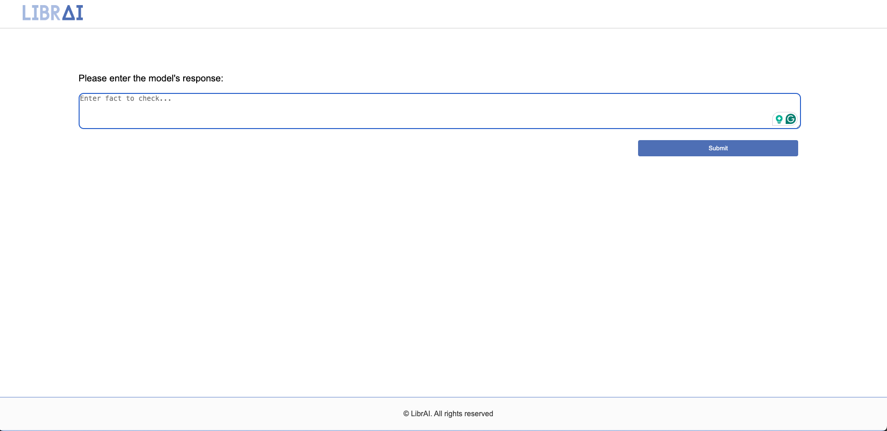
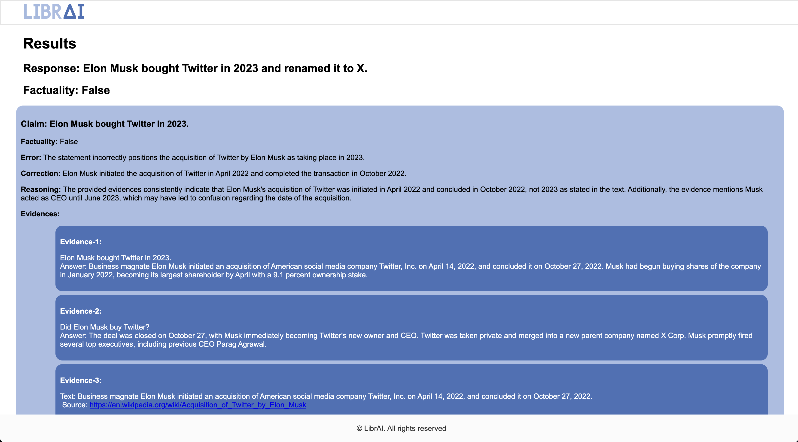

# User Guide

- [User Guide](#user-guide)
  - [Installation](#installation)
    - [Clone the repository and navigate to the project directory](#clone-the-repository-and-navigate-to-the-project-directory)
    - [Installation with poetry (option 1)](#installation-with-poetry-option-1)
    - [Installation with pip (option 2)](#installation-with-pip-option-2)
  - [Configure API Keys](#configure-api-keys)
    - [Environment Variables](#environment-variables)
    - [Configuration Files](#configuration-files)
    - [Additional API Configurations](#additional-api-configurations)
  - [Basic Usage](#basic-usage)
    - [Used in Command Line](#used-in-command-line)
    - [Used as a Library](#used-as-a-library)
    - [Used as a Web App](#used-as-a-web-app)
  - [Advanced Features](#advanced-features)
    - [Multimodality](#multimodality)
    - [Customized Prompts](#customized-prompts)
    - [Switch Between Models](#switch-between-models)
    - [Switch Between Search Engine](#switch-between-search-engine)

## Installation

### Clone the repository and navigate to the project directory
```bash
git clone https://github.com/Libr-AI/OpenFactVerification.git
cd OpenFactVerification
```

### Installation with poetry (option 1)
1. Install Poetry by following it [installation guideline](https://python-poetry.org/docs/).
2. Install all dependencies by running:
```bash
poetry install
```

### Installation with pip (option 2)
1. Create a Python environment at version 3.9 or newer and activate it.

2. Navigate to the project directory and install the required packages:
```bash
pip install -r requirements.txt
```

## Configure API Keys

API keys can be configured from both **Environment Variables** and **Configuration Files**.
Specifically, the tool initialization loads API keys from environment variables or config file, config file take precedence. Related implementations can be seen from `factcheck/utils/api_config.py`.

### Environment Variables
Example: Export essential api key to the environment
```bash
export SERPER_API_KEY=... # this is required in evidence retrieval if serper being used
export OPENAI_API_KEY=... # this is required in all tasks
export ANTHROPIC_API_KEY=... # this is required only if you want to replace openai with anthropic
export LOCAL_API_KEY=... # this is required only if you want to use local LLM
export LOCAL_API_URL=... # this is required only if you want to use local LLM
```

### Configuration Files

Alternatively, we can store the api information in a YAML file with the same key names as the environment variables and pass the path to the yaml file as an argument to the `check_response` method.

Example: Pass the path to the api configuration file

```YAML
SERPER_API_KEY: null

OPENAI_API_KEY: null

ANTHROPIC_API_KEY: null

LOCAL_API_KEY: null
LOCAL_API_URL: null
```

To load api configurations from a YAML file, please specify the path to the YAML file with the argument `--api_config`

```bash
python -m factcheck --modal string --input "MBZUAI is the first AI university in the world" --api_config PATH_TO_CONFIG_FILE/api_config.yaml
```

### Additional API Configurations

The supported api configuration variables are pre-defined in `factcheck/utils/api_config.py`.
```python
# Define all keys for the API configuration
keys = [
    "SERPER_API_KEY",
    "OPENAI_API_KEY",
    "ANTHROPIC_API_KEY",
    "LOCAL_API_KEY",
    "LOCAL_API_URL",
]
```

Only these variables can be loaded from **Environment Variables**. If additional variables are required, you are recommended to define these variable in a YAML files. All variables in the api configuration file will be loaded automatically.

## Basic Usage

### Used in Command Line

```python
python -m factcheck --input "MBZUAI is the first AI university in the world"
```

### Used as a Library

```python
from factcheck import FactCheck

factcheck_instance = FactCheck()

# Example text
text = "Your text here"

# Run the fact-check pipeline
results = factcheck_instance.check_response(text)
print(results)
```
### Used as a Web App

```bash
python webapp.py --api_config demo_data/api_config.yaml
```

<p align="center"></p>
<p align="center"></p>

## Advanced Features

### Multimodality

Different modalities (text, speech, image, and video) are unified in this tool by converting them into text, and then verified by the standard text fact verification pipeline.

```bash
# String
python -m factcheck --modal string --input "MBZUAI is the first AI university in the world"
# Text
python -m factcheck --modal text --input demo_data/text.txt
# Speech
python -m factcheck --modal speech --input demo_data/speech.mp3
# Image
python -m factcheck --modal image --input demo_data/image.webp
# Video
python -m factcheck --modal video --input demo_data/video.m4v
```

### Customized Prompts
Prompts for each step can be specified in a YAML/JSON file. Please see `factcheck/config/sample_prompt.yaml` as an example.

For now, there are four prompts in each file with respect to claim decomposition, claim checkworthy, query generation, and claim verification, respectively.

When using your own prompts, please use `--prompt` to specify the prompt file path.


```bash
python -m factcheck --input "MBZUAI is the first AI university in the world" --prompt PATH_TO_PROMPT/sample_prompt.yaml
```


### Switch Between Models

Currently, Loki supports models from OpenAI, Anthropic, and local-hosted models. To specify the model version used for fact checking, there are two arguments `--model` and `--client`.
Please see `factcheck/utils/llmclient/__init__.py` for details.

| Model     | --model        | --client     |
|-----------|----------------|--------------|
| OpenAI    | gpt-VERSION    | None         |
| Anthropic | claude-VERSION | None         |
| Local     | MODEL_NAME     | local_openai |


```bash
# OpenAI
python -m factcheck --modal string --input "MBZUAI is the first AI university in the world" --model gpt-4-turbo

# Anthropic
python -m factcheck --modal string --input "MBZUAI is the first AI university in the world" --model claude-3-opus-20240229

# Local
python -m factcheck --modal string --input "MBZUAI is the first AI university in the world"  --client local_openai --model wizardlm2
```

The prompt can be model-specific, especially if we ask the model to output a JSON format response. We have yet to have a chance to support all models, so you will have to adopt your own prompts when using models other than openai.

Besides, when using local_openai models, please make sure to specify `LOCAL_API_KEY` and `LOCAL_API_URL`.

### Switch Between Search Engine
Currently google search and Serper are supported. You can switch between different search engines with the argument `--retriever`.


```bash
# Serper
python -m factcheck --modal string --input "MBZUAI is the first AI university in the world"  --retriever serper

# Google
python -m factcheck --modal string --input "MBZUAI is the first AI university in the world"  --retriever google
```

You can get a serper key from https://serper.dev/
